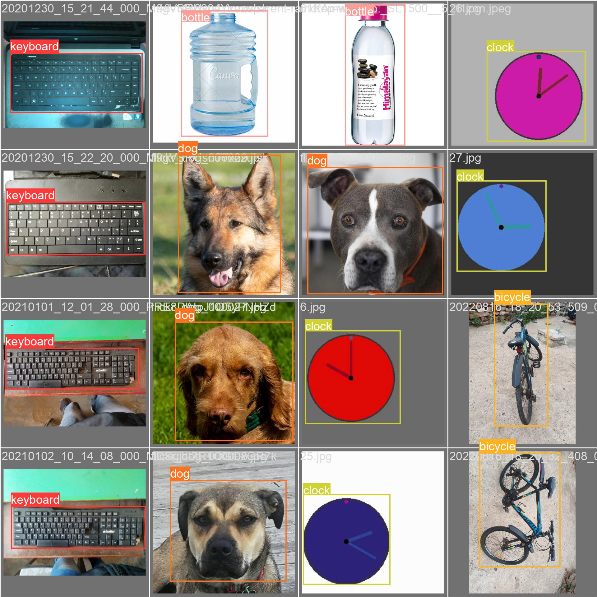
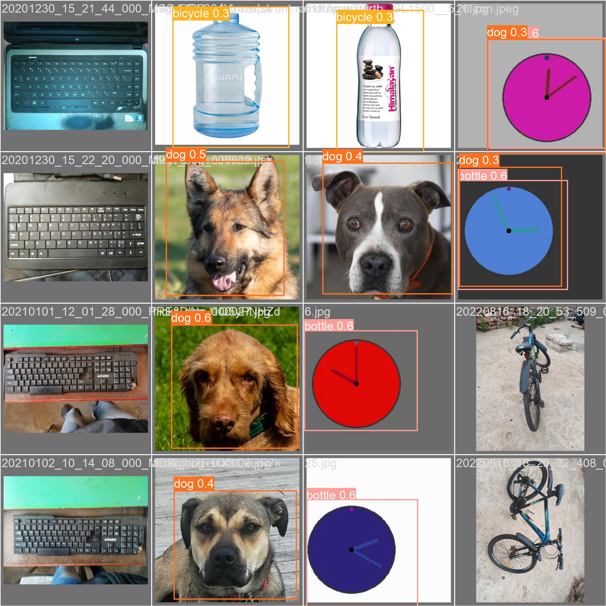
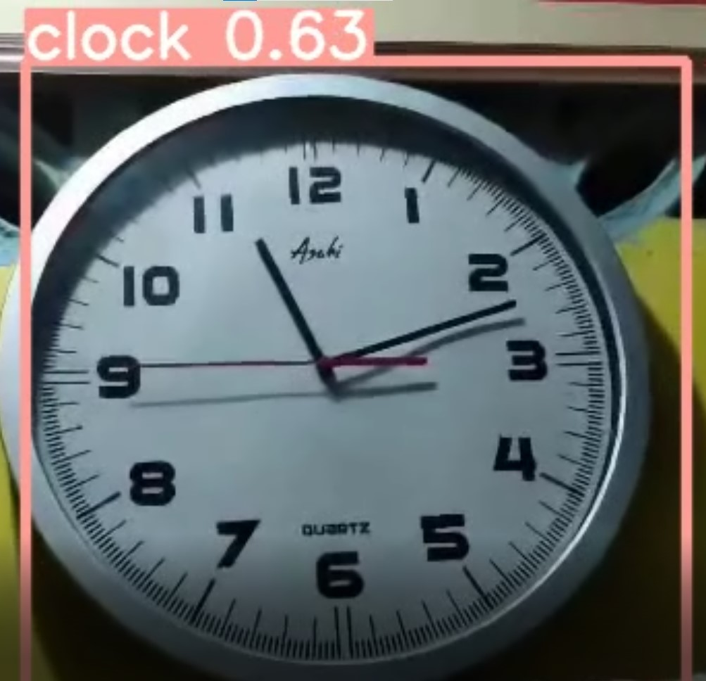

# Object-Recognition-System (WIP)
Recognizing objects-subject from a live camera feed based on YOLOv5

## Credits
- [Tutorial](https://www.youtube.com/watch?v=GRtgLlwxpc4)
- [YOLOv5](https://github.com/ultralytics/yolov5)
- [Install PyTorch](https://gist.github.com/vandbt/62e137881a9e2014d4ded452d3e8e8dd)
- [Makesense.ai](https://www.makesense.ai)
- [Downloading a folder via being zipped](https://philipkiely.com/code/colab_download)

- ### Dataset
  - [Bicycle](https://www.kaggle.com/datasets/dataclusterlabs/bicycle-image-dataset-vehicle-dataset/)
  - [Clock](https://www.kaggle.com/datasets/shivajbd/analog-clocks/data)
  - [Electronics (Keyboard)](https://www.kaggle.com/datasets/dataclusterlabs/electronics-mouse-keyboard-image-dataset)
  - [Water Bottles](https://www.kaggle.com/datasets/dataclusterlabs/electronics-mouse-keyboard-image-dataset)
  - [Animals (only used dogs)](https://www.kaggle.com/datasets/andrewmvd/animal-faces)

- ### Sample Output
   | 
  :---: | :---:
  
  ](3_vid-result.mp4)

